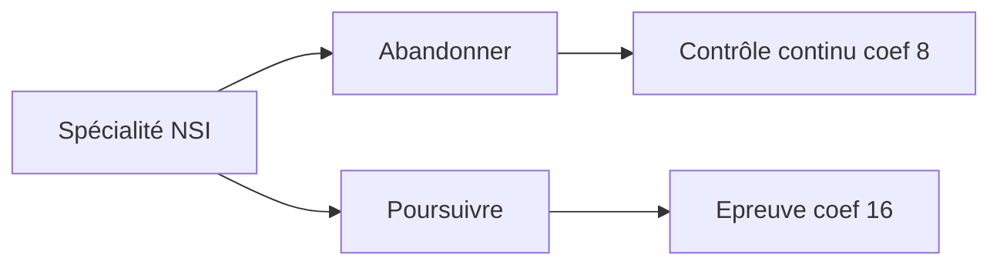

# Spécialité Informatique

## N.S.I.

## Lycée de Cornouaille

---
layout: image-right
image: /_1b6b1a6c-cd9a-461f-b117-74effbe09e66.jpeg
---

# La spécialité Informatique (NSI)

- NSI = Numérique et Sciences Informatiques

- Une spécialité qui permet de **découvrir** et d'**approfondir** les concepts et les méthodes de l'**informatique**

- Une discipline **transversale** et ouverte sur tous les domaines

---
layout: cover
background: https://res.cloudinary.com/dpw19qolx/image/upload/v1562052876/nebulae-1199180_1920.jpg
---

# Objectifs de la NSI

  - **Initier** aux concepts et aux méthodes de l'informatique
  - **Développer** la capacité à analyser, modéliser et résoudre des problèmes
  - **Stimuler** la créativité et l'esprit critique
  - **Sensibiliser** aux enjeux sociétaux et éthiques du numérique

---
layout: image-right
image: /_53ca1f1e-5c7c-4186-a404-e553e9ee44ba.jpeg
---

# Pourquoi choisir la NSI 

- **Pas de prérequis** : juste de la curiosité et de la motivation
- **Complémentarité** avec d’autres spécialités : arts, sciences, économie, etc.
- Des domaines **passionnants et variés**

---
layout: image-right
image: https://res.cloudinary.com/dpw19qolx/image/upload/v1561731158/shahadat-shemul-gnyA8vd3Otc-unsplash.jpg
---

# Thèmes

  - Les langages de programmation
  - Les structures de données
  - Les algorithmes
  - Les architectures matérielles
  - Les réseaux
  - La sécurité
  - Les bases de données
  - L'intelligence artificielle

---
layout: cover
background: https://res.cloudinary.com/dpw19qolx/image/upload/v1562052876/nebulae-1199180_1920.jpg
---

# Pédagogie de Projets

- Privilégie les **projets** et les **mini-projets**. 

- Travail en **petits groupes** sur des défis logiques à résoudre (en Python principalement). 

- Concevoir des algorithmes, coder des programmes, tester et déboguer les solutions. 

- Etre **créatifs**, exprimer leurs idées, partager leurs réalisations.

---
layout: cover
background: https://res.cloudinary.com/dpw19qolx/image/upload/v1562052876/nebulae-1199180_1920.jpg
---

# Compétences transversales

Compétences transversales utiles dans tous les domaines : 

- logique, 
- analyse, 
- résolution de problèmes, 
- communication, 
- coopération, ...

---
layout: cover
background: https://res.cloudinary.com/dpw19qolx/image/upload/v1562052876/nebulae-1199180_1920.jpg
---

# Formations supérieures

La NSI ouvre les portes de nombreuses formations supérieures en informatique et numérique :

- prépas, 
- BUT, 
- BTS, 
- licences, 
- écoles d’ingénieurs, ..

---
layout: cover
background: https://res.cloudinary.com/dpw19qolx/image/upload/v1562052876/nebulae-1199180_1920.jpg
---

# Secteurs d'emploi

Secteurs d’emploi variés et attractifs: 

- Santé
- Environnement
- Education
- Services
- Industrie
- Culture
- Droit, ...

---
layout: cover
background: https://res.cloudinary.com/dpw19qolx/image/upload/v1562052876/nebulae-1199180_1920.jpg
---

# Métiers domaine informatique

  - Développement logiciel
  - Cybersécurité
  - Réseaux - Télécom
  - Ingénieur
  - Science des données
  - Web designer
  - Enseignement - Recherche
  - Etc.

---

# Après la classe de première

Epreuve terminale:
- épreuve écrite de 3h30 sur 20 pour 3/4 de la note finale
- épreuve pratique de 1h sur 20 pour 1/4 de la note finale

---
layout: cover
background: https://res.cloudinary.com/dpw19qolx/image/upload/v1562052876/nebulae-1199180_1920.jpg
---

# Au lycée de Cornouaille 

- Pour l'année scolaire 2023-2024
  - Deux groupes de 1ères NSI: 45 élèves
  - Un groupe de Terminales NSI: 13 élèves
- Bac 2023: Moyenne 17,8 pour des notes de 16 à 19/20
- Bac 2022: Moyenne 18,1 pour des notes de 14 à 20/20

---
layout: cover
background: https://res.cloudinary.com/dpw19qolx/image/upload/v1562052876/nebulae-1199180_1920.jpg
---

# Pour en savoir plus

- Journée Porte Ouverte le **samedi 16 mars 2024**
- Eduscol, ONISEP, ...

---

# À retenir

- La spécialité NSI, c'est :
  - Une spécialité pour tous les élèves qui s'intéressent au numérique et à l'informatique, qu'ils soient ou non scientifiques
  - Une spécialité qui se marie très bien avec d'autres spécialités.
  - Une spécialité qui permet de développer des compétences transversales.
  - Une spécialité qui privilégie les projets et les mini-projets, qui stimulent la créativité et l'esprit critique des élèves
  - Une spécialité qui ouvre les portes de nombreux métiers liés au numérique et à l'informatique, mais pas seulement.

