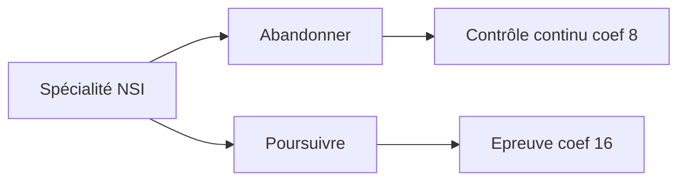

# Spécialité N.S.I.

## Lycée de Cornouaille

---
layout: image-right
image: /_1b6b1a6c-cd9a-461f-b117-74effbe09e66.jpeg
---

# La spécialité Informatique (NSI)

- NSI = Numérique et Sciences Informatiques

- Une spécialité qui permet de **découvrir** et d'**approfondir** les concepts et les méthodes de l'**informatique**

- Une discipline **transversale** et ouverte sur tous les domaines

---
theme: eloc
layout: center
---

# Objectifs de la NSI

Elle permet aux élèves de découvrir le monde du numérique et de l'informatique.

La spécialité NSI vise à :
  - **Initier** les élèves aux concepts et aux méthodes de l'informatique
  - **Développer** leur capacité à analyser, modéliser et résoudre des problèmes
  - **Stimuler** leur créativité et leur esprit critique
  - **Sensibiliser** aux enjeux sociétaux et éthiques du numérique

---

# Pourquoi choisir la spécialité NSI 

- La spécialité NSI s'adresse à tous les élèves qui s'intéressent au numérique et à l'informatique, qu'ils soient ou non scientifiques. Il n'y a pas de prérequis particuliers pour suivre cette spécialité, si ce n'est de la curiosité et de la motivation.
- La spécialité NSI se marie très bien avec d'autres spécialités, comme les arts plastiques ou les sciences économiques et sociales. En effet, l'informatique n'est pas une discipline isolée, mais au contraire, elle est en interaction avec de nombreux autres domaines.

---

# Thèmes de la spécialité NSI

- Le programme de la spécialité NSI couvre les grands thèmes de l'informatique, comme :
  - Les langages de programmation
  - Les structures de données
  - Les algorithmes
  - Les architectures matérielles
  - Les réseaux
  - La sécurité
  - Les bases de données
  - L'intelligence artificielle

---

# Pédagogie en NSI

- La pédagogie de la spécialité NSI privilégie les **projets** et les mini-projets. 

- Les élèves sont amenés à travailler en **petits groupes** sur des défis logiques à résoudre avec les langages de programmation les plus utilisés en informatique. 

- Ils apprennent ainsi à concevoir des algorithmes, à coder des programmes, à tester et à déboguer leurs solutions. 

- Ils sont aussi encouragés à être **créatifs**, à exprimer leurs idées, à partager leurs réalisations.

---

# Etudes après la spécialité NSI

- La spécialité NSI prépare les élèves à poursuivre des études supérieures dans le domaine du numérique et de l'informatique, mais pas seulement. 

En effet, la spécialité NSI permet de développer des compétences transversales, comme:
- la logique, 
- l'analyse, 
- la résolution de problèmes, 
- la communication, 
- la collaboration, etc. 

Ces compétences sont utiles dans tous les domaines d'études et de métiers.

---

# Métiers après la spécialité NSI

- La spécialité NSI ouvre les portes de nombreux métiers liés au numérique et à l'informatique, mais pas seulement. 

En effet, le numérique et l'informatique sont présents dans tous les secteurs d'activité, comme:

- l'environnement,
- la santé, 
- l'éducation, 
- la culture, 
- le droit, etc. 

La spécialité NSI permet donc de découvrir des **métiers variés et passionnants**.

---

# Métiers domaine informatique

  - Développement logiciel
  - Cybersécurité
  - Réseaux - Télécom
  - Ingénieur
  - Data scientist
  - Web designer
  - Enseignement - Recherche
  - Etc.

---

# Après la classe de première

Epreuve terminale:
- épreuve écrite de 3h30 sur 20 pour 3/4 de la note finale
- épreuve pratique de 1h sur 20 pour 1/4 de la note finale

---

# Au lycée de Cornouaille 

- Pour l'année scolaire 2023-2024
  - Deux groupes de 1ères NSI: 46 élèves
  - Un groupe de Terminales NSI: 13 élèves
- Bac 2023: Moyenne 17,8 pour des notes de 16 à 19/20
- Bac 2022: Moyenne 18,1 pour des notes de 14 à 20/20

---

# À retenir

- La spécialité NSI, c'est :
  - Une spécialité pour tous les élèves qui s'intéressent au numérique et à l'informatique, qu'ils soient ou non scientifiques
  - Une spécialité qui se marie très bien avec d'autres spécialités.
  - Une spécialité qui permet de développer des compétences transversales.
  - Une spécialité qui privilégie les projets et les mini-projets, qui stimulent la créativité et l'esprit critique des élèves
  - Une spécialité qui ouvre les portes de nombreux métiers liés au numérique et à l'informatique, mais pas seulement.

